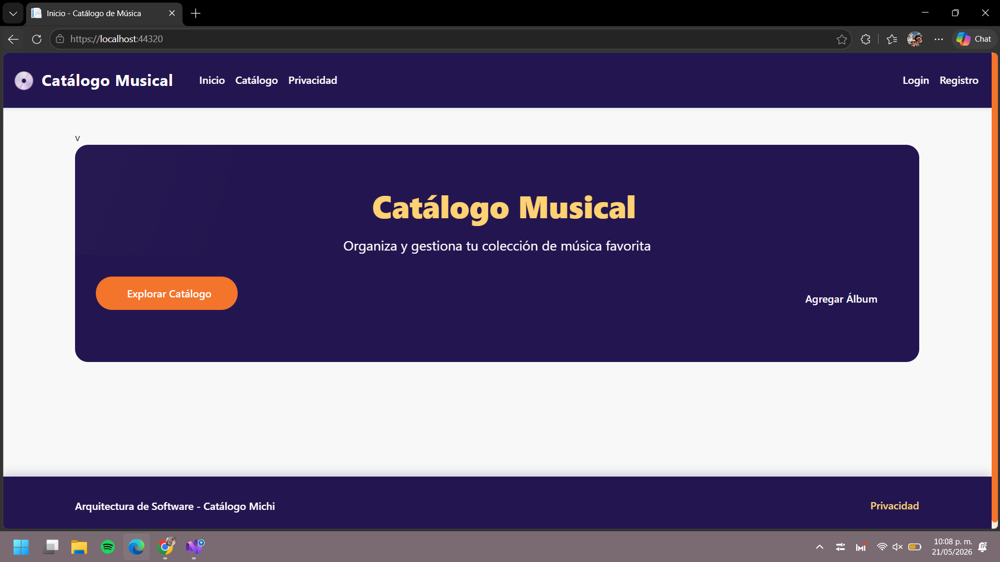
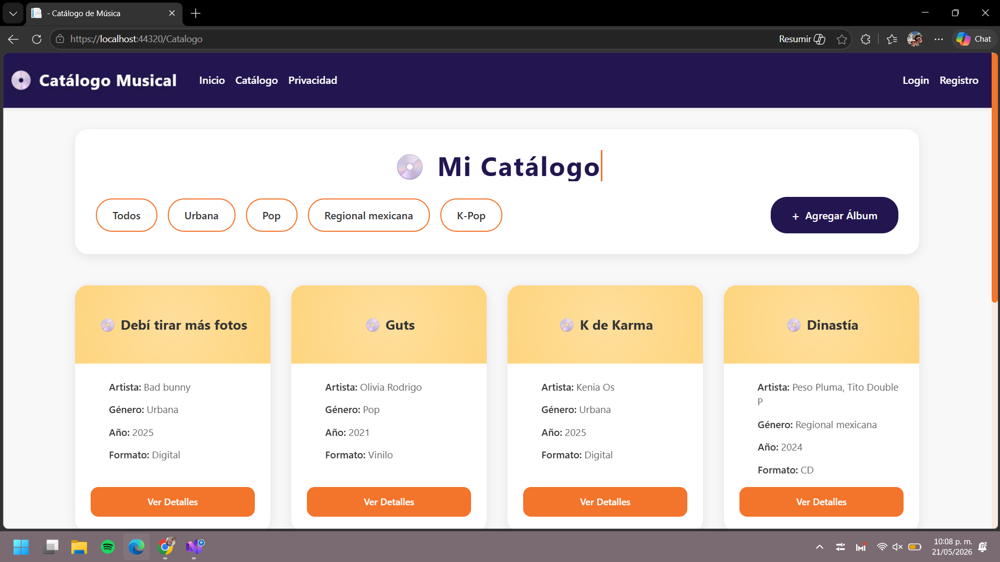
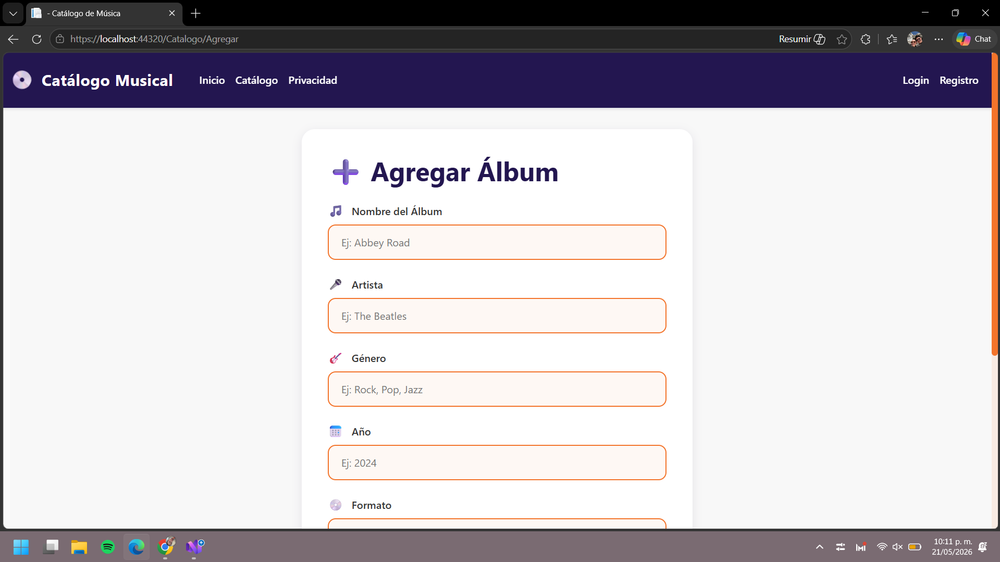
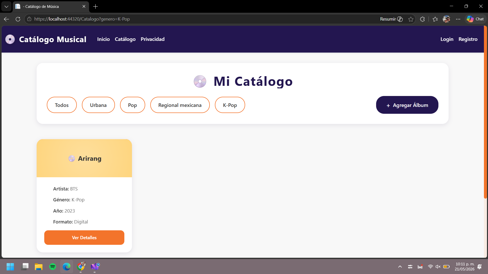
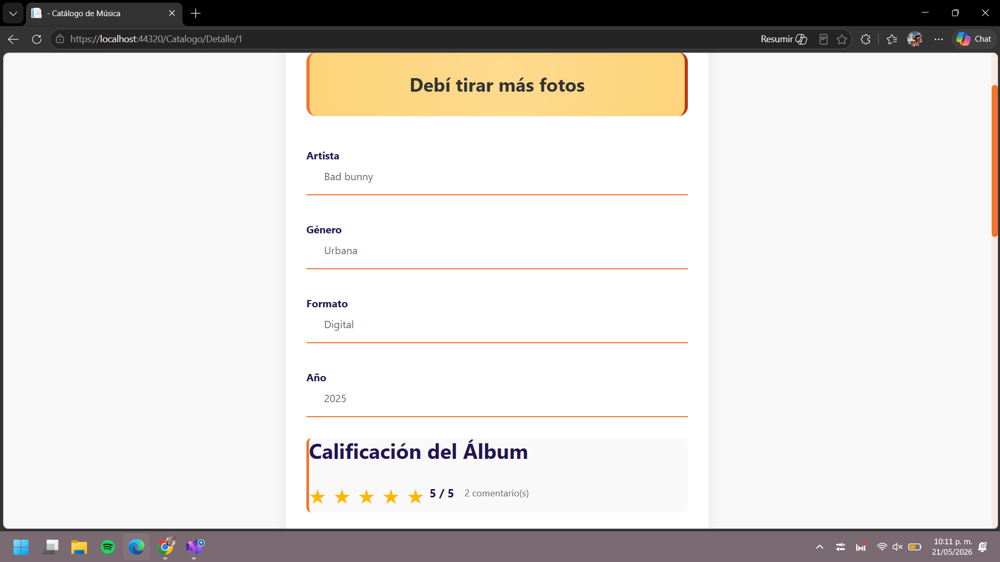
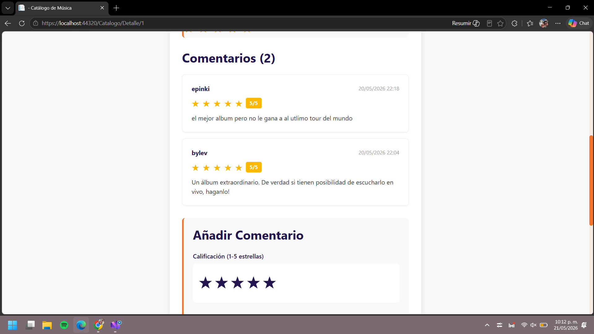
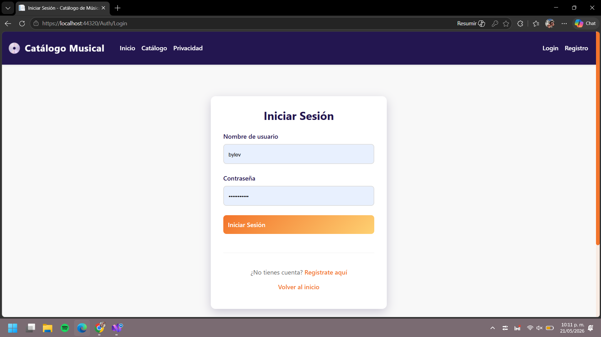
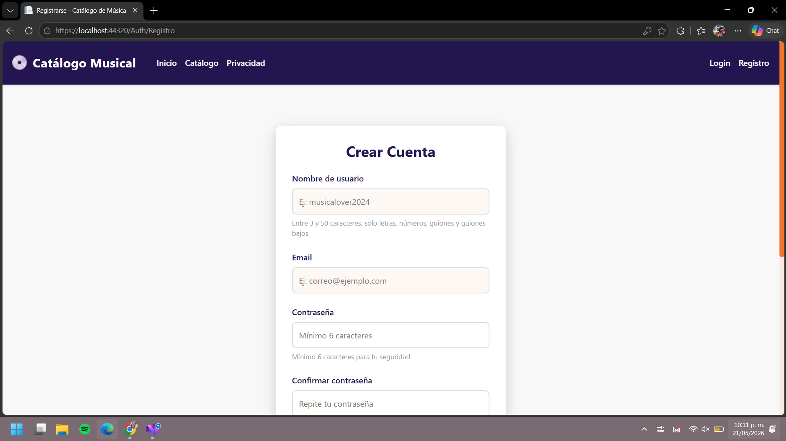

# Catalogo App
 
El objetivo es crear una aplicación web de catálogo de música utilizando ASP.NET Core 10 con el patrón MVC. La aplicación permitirá a los usuarios navegar por un catálogo de álbumes, calificar cada álbum con un sistema de estrellas, y dejar comentarios. Los datos se almacenarán en archivos JSON para persistencia.


## Descripción del Proyecto

**CatalogoApp** es una plataforma interactiva que permite a los usuarios:

- **Navegar un catálogo** de álbumes y canciones con detalles completos
- **Calificar contenido** con un sistema de 1-5 estrellas
- **Comentar y compartir opiniones** sobre los álbumes
- **Gestionar perfil de usuario** con autenticación segura
- **Filtrar y buscar** contenido de manera sencilla
- **Ver ratings promedio** de cada álbum

### Características Principales

- Interfaz intuitiva y responsiva. 
- Almacenamiento de datos en JSON para fácil manejo y persistencia.
- Implementación de un sistema de autenticación básico para gestionar usuarios y sus interacciones.
- Uso de ASP.NET Core MVC para una separación clara de responsabilidades y una arquitectura escalable.
---

## Tecnologías Utilizadas

### Backend
- **Framework**: ASP.NET Core 10 (.NET 10)
- **Lenguaje**: C#
- **Patrón**: MVC (Model-View-Controller)

### Frontend
- **HTML** - Estructura semántica
- **CSS** - Estilos avanzados con variables CSS
- **JavaScript** - Interactividad y validación
+

### Datos
- **JSON** - Almacenamiento persistente (Data Layer)


### Arquitectura
- **Capas**: 
  - 📦 **Catalogo.Presentation** - Vistas y Controladores
  - 📦 **Catalogo.Application** - Lógica de negocio (Services)
  - 📦 **Catalogo.Infrastructure** - Acceso a datos (Repositories)
  - 📦 **Catalogo.Domain** - Modelos y Interfaces

---

## Estructura del Proyecto

```
CatalogoApp/
├── Catalogo.Presentation/          # Proyecto principal (MVC)
│   ├── Controllers/                # Controladores (Home, Catalogo, Auth)
│   ├── Views/
│   │   ├── Catalogo/              # Vistas de catálogo
│   │   │   ├── Index.cshtml       # Listado de álbumes
│   │   │   ├── Detalle.cshtml     # Detalle + comentarios + ratings
│   │   │   └── Agregar.cshtml     # Formulario nuevo álbum
│   │   └── Home/                  # Vistas de home
│   ├── wwwroot/
│   │   ├── css/                   # Estilos personalizados
│   │   ├── js/                    # Scripts JavaScript
│   │   └── lib/                   # Librerías (Bootstrap, jQuery)
│   ├── data/
│   │   ├── items.json             # Base de datos de álbumes
│   │   └── Comentarios.json       # Base de datos de comentarios
│   └── Program.cs                 # Configuración de la app
│
├── Catalogo.Application/           # Servicios de negocio
│   └── Services/
│       ├── ItemService.cs
│       ├── ComentarioService.cs
│       └── UsuarioService.cs
│
├── Catalogo.Infrastructure/        # Acceso a datos
│   └── Repositories/
│       ├── JsonItemRepository.cs
│       └── JsonComentarioRepository.cs
│
└── Catalogo.Domain/                # Modelos y contratos
    ├── Models/
    │   ├── Item.cs
    │   ├── Comentario.cs
    │   └── Usuario.cs
    └── Interfaces/
        └── IItemRepository.cs
```

---

# Funcionamiento











# Claúsula de IA

Utilicé la IA para comprender mejor el flujo de cómo podría funcionar un autenticador de sesiones, como crear un login y logout coherente. Y además con el mismo realicé las modificaciones de interfaz
para darle un mejor rendimiento a la aplicación y su flujo.

